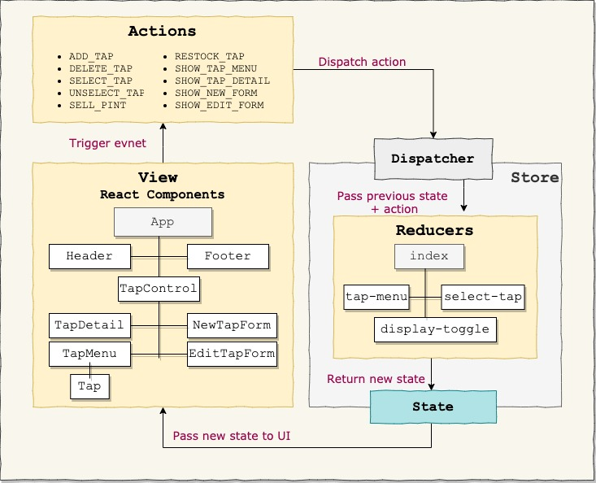

# :beer: Tap Room

#### React with Redux Independence Project, 5.1.2020

#### By **_Jieun Kang_**
[](https://www.repostatus.org/#wip)


[](https://lbesson.mit-license.org/)


## 1. Description
A React application where a tap room can track their kegs. This website has full CRUD funcionality to tap room. 
* Updated to incorporate Redux.
* _View working page at_ https://jieunkang-101.github.io/TapRoom-Redux

### :small_orange_diamond: Preview


### :small_orange_diamond: User Stories
  * As a seller, I want to see a menu of all available kegs. For each keg, I want to see its name, brand, price and ABV(Alcohol by Volume).
  * As a seller, I want to submit a form to add a new keg to a list.
  * As a seller, I want to see how many pints are left in a keg. A full keg has roughly 124 pints.
  * As a seller, I want to be able to click a button next to a keg whenever I sell a pint of it. This should decrease the number of pints left by 1. Pints should not be able to go below 0.
  * As a seller, I want kegs with less than 10 pints to include a message that says "Almost Empty" so I can try a pint before it's gone!
  * As a seller, I want a keg to update to say "Out of Stock" once it's empty.
  * As a seller, I want to be able to click on a keg to see its detail page.
  * As a seller, I want the option to edit a keg's properties after entering them just in case I make a mistake.
  * As a seller, I want to be able to delete a keg.
  * As a seller, I want to have kegs stock message to be color-coded for easy readability. This is based on the amount of pints left.

### :small_orange_diamond: Component Diagram with Wireframe : Round 1
  

### :small_orange_diamond: Component Diagram : Round 2
   

### Designing Components
```

```

## 2. Development
### :small_orange_diamond: Technologies Used:
+ [ReactJs](https://reactjs.org/) 
+ [Redux 4.0.5](https://redux.js.org/)
+ [React Redux 7.1.3](https://react-redux.js.org/)
+ [npm](https://www.npmjs.com/) 
+ [Webpack](https://webpack.js.org/)
+ [bootstrap 4.4.1](https://getbootstrap.com/)

### :small_orange_diamond: Run this project to development server
```bash
  $ git clone https://github.com/jieunkang-101/TapRoom
  $ cd TapRoom
  $ npm install  
  $ npm start
```
Now, it will automatically open http://localhost:3000 and show you Tap Room website.

## 3. Known Bugs
There are no known bug at this moment

## 4. Support and contact details
Any feedback is appreciated! Please contact at email: jieunkang101@gmail.com 

### License
*This software is licensed under the MIT license*
Copyright (c) 2020 **_Jieun Kang_**
